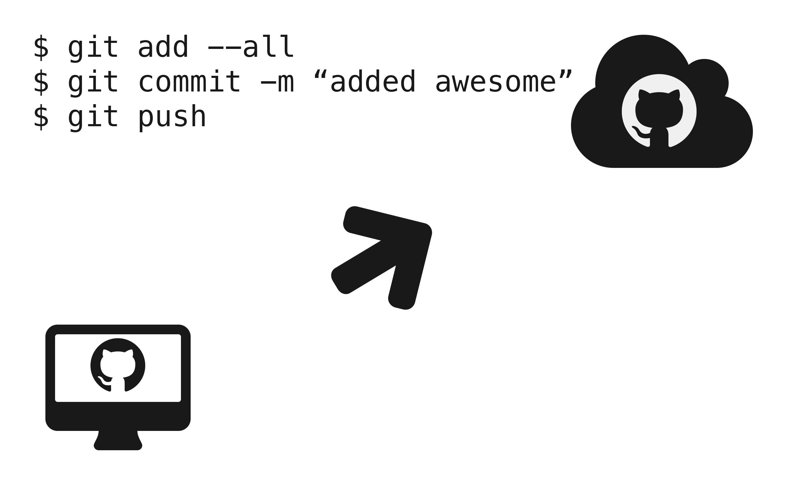
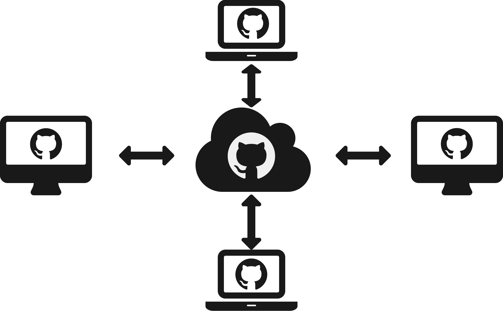
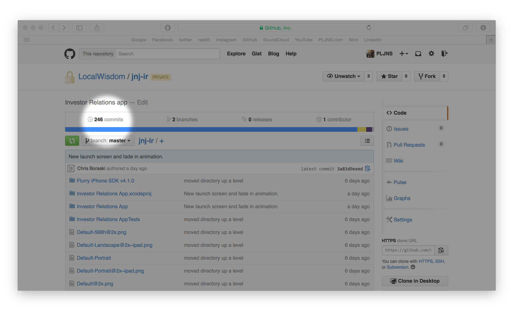
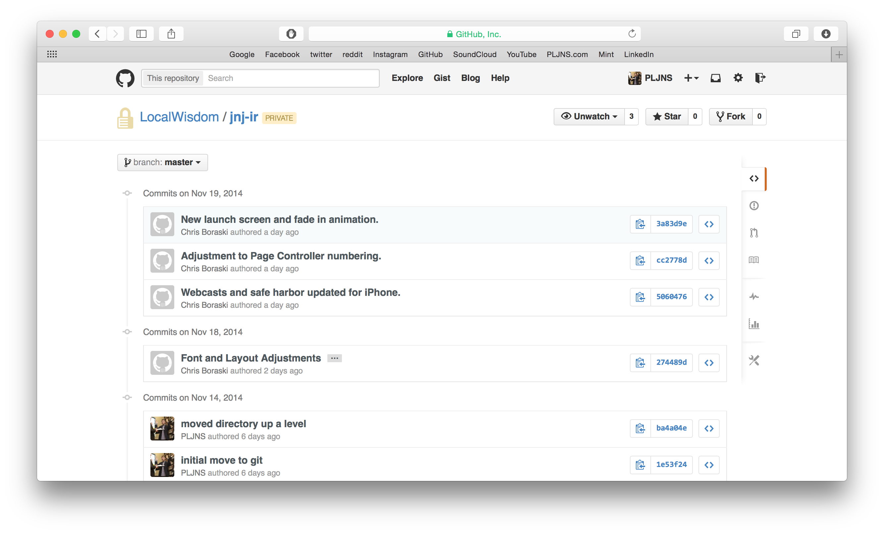

Introduction
============

### 

\begin{center}
We used to use a number of disparate services to provide
source control, issue tracking, and documentation for deliverables.
\end{center}

### 

\begin{center}
But now, one service provides all three functionalities.
\end{center}

### 

\begin{center}
\huge We build software. \\
GitHub lets us build better.
\end{center}

### Meet GitHub

### What is GitHub?

noun

**GitHub** is a code repository hosting service, which offers all the features of `git` as well as adding its own features, such as: 

-   Issue-tracking
-   Wikis
-   Project web pages

### What is `git`?

noun

`git` is a source control system with support for distributed and non-linear workflows.

### "Source Control"

### "Source Control"

### "Distributed"

### "Non-Linear"

### All Platforms

Issue Tracking
==============

### 

\begin{center}
\huge GitHub gives you \\
a way to communicate with dev.
\end{center}

### 

### 

### 

\begin{center}
\huge Pause for demo.
\end{center}

### Overview

-   Title and description
-   Color-coded labels
-   Milestones
-   One assignee
-   Comments

Version Control
===============

### 

\begin{center}
\huge GitHub gives you \\
a way to browse history.
\end{center}

### 

### 

### 

\begin{center}
\huge Pause for demo.
\end{center}

### Overview

-   Every commit to a PSD is a design change.
-   Developers can quickly see what's new.
-   Every commit describes progress.
-   All viewable on Windows, Mac, and the Web.

Documentation
=============

### 

\begin{center}
\huge GitHub gives you \\
a way to document knowledge.
\end{center}

### 

### 

### 

\begin{center}
\huge Pause for demo.
\end{center}

### Overview

-   GitHub Wikis are a place in your repository where we can share long-form content 
    about our projects, such as: 
    -   how to use it, 
    -   how it's been designed, and
    -   planned features.

-   Wikis can be edited directly on GitHub, or you can work with a text editor offline 
    and simply push your changes.
-   You can:
    -   Add images
    -   Create sidebars
    -   Create footgers
    -   Edit locally
    -   View history

Conclusion
==========

### 

\begin{center}
\huge GitHub allows us to \\
build better software, \\
together.
\end{center}

### Advanced Topics

-   GitHub lets you publish HTML straight to the web from any branch named "`gh_pages`".
-   GitHub supports mentioning people with @, linking issues using #, 
    using emoji, and adding images.
-   If you want to close issue #35, put closes #35 somewhere in your commit message. 
-   Markdown, the markup language used for GitHub documentation, is useful for much
    more than GitHub: this presentation was written in Markdown!

###

\begin{center}
After this presentation, I'll send an internal all email with a link 
where you can use your Local Wisdom email to create a GitHub profile
to get you started.
\end{center}

### 

\begin{center}
\Huge Thank you!
\end{center}

