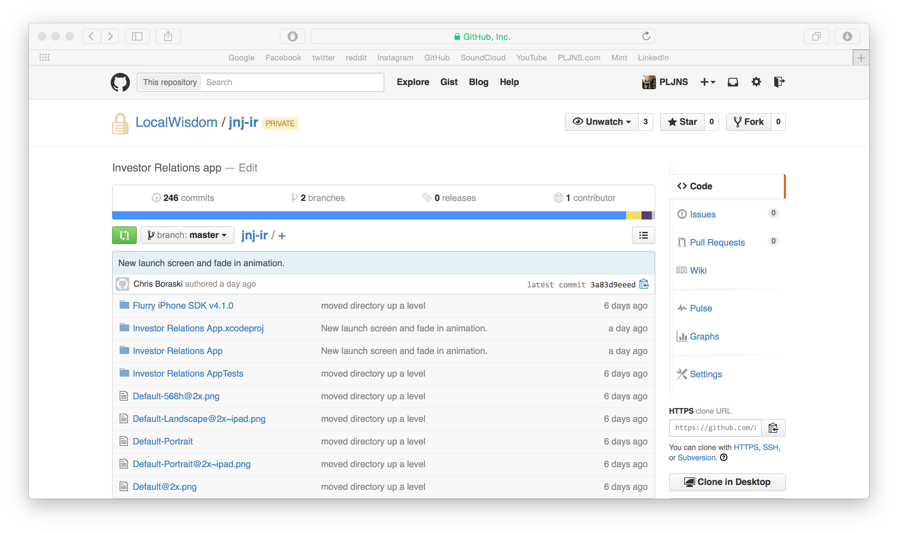
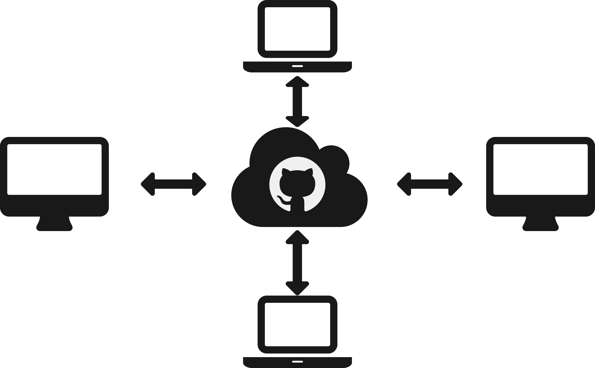
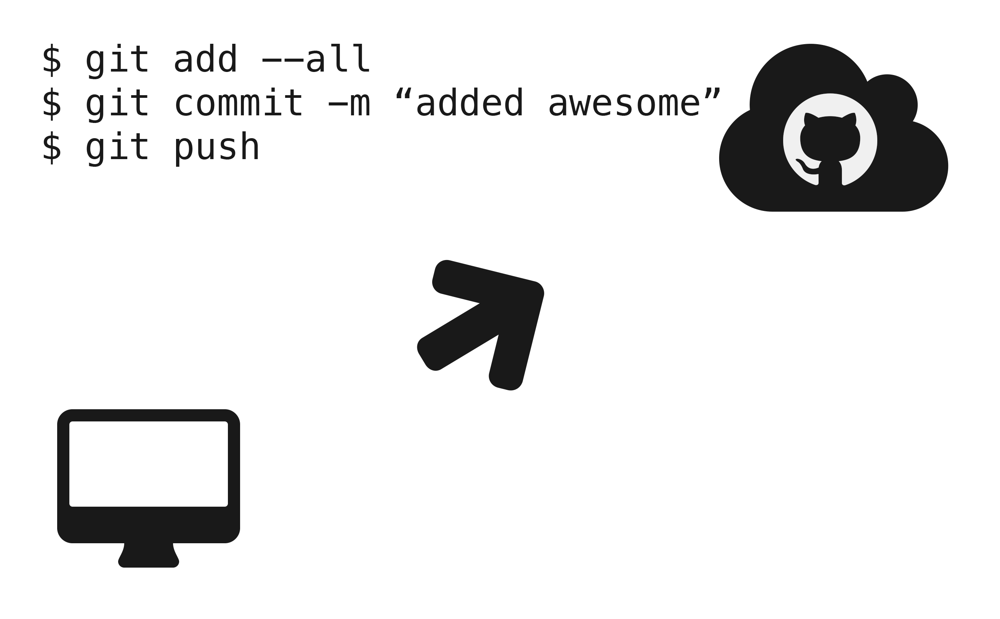
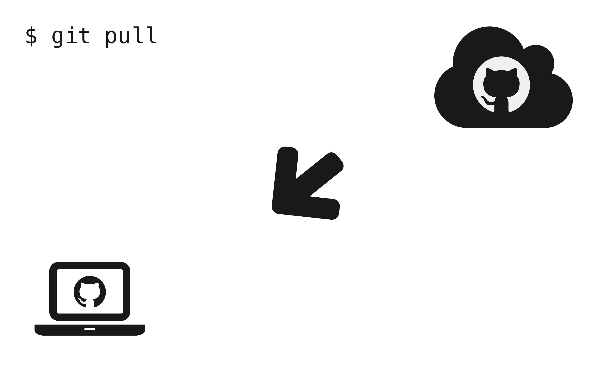
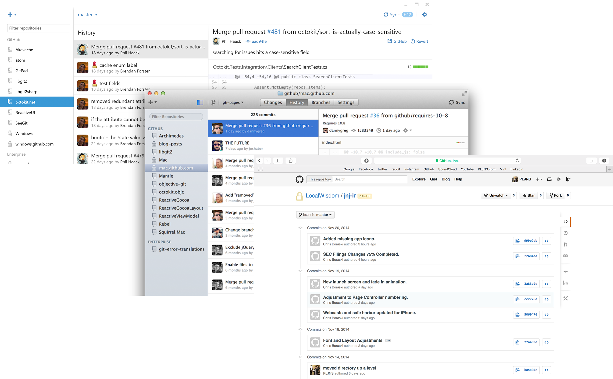
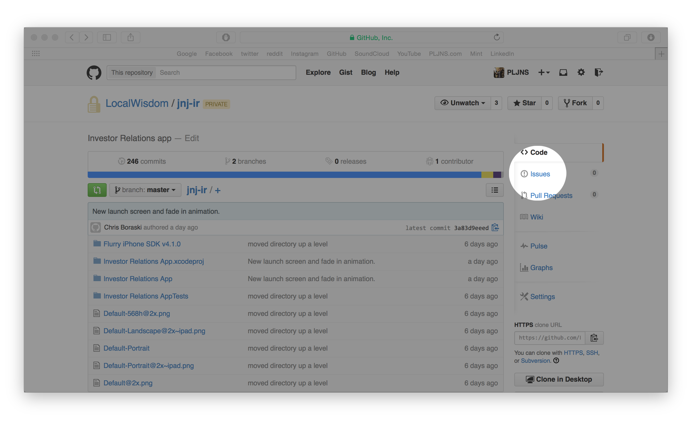
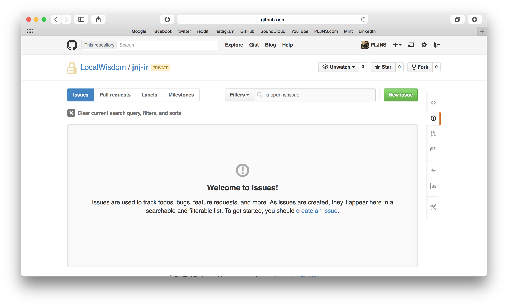
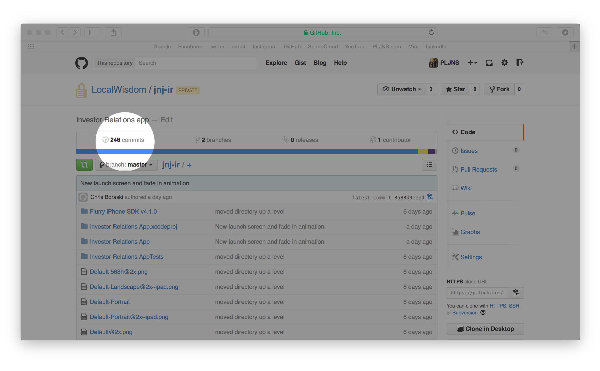
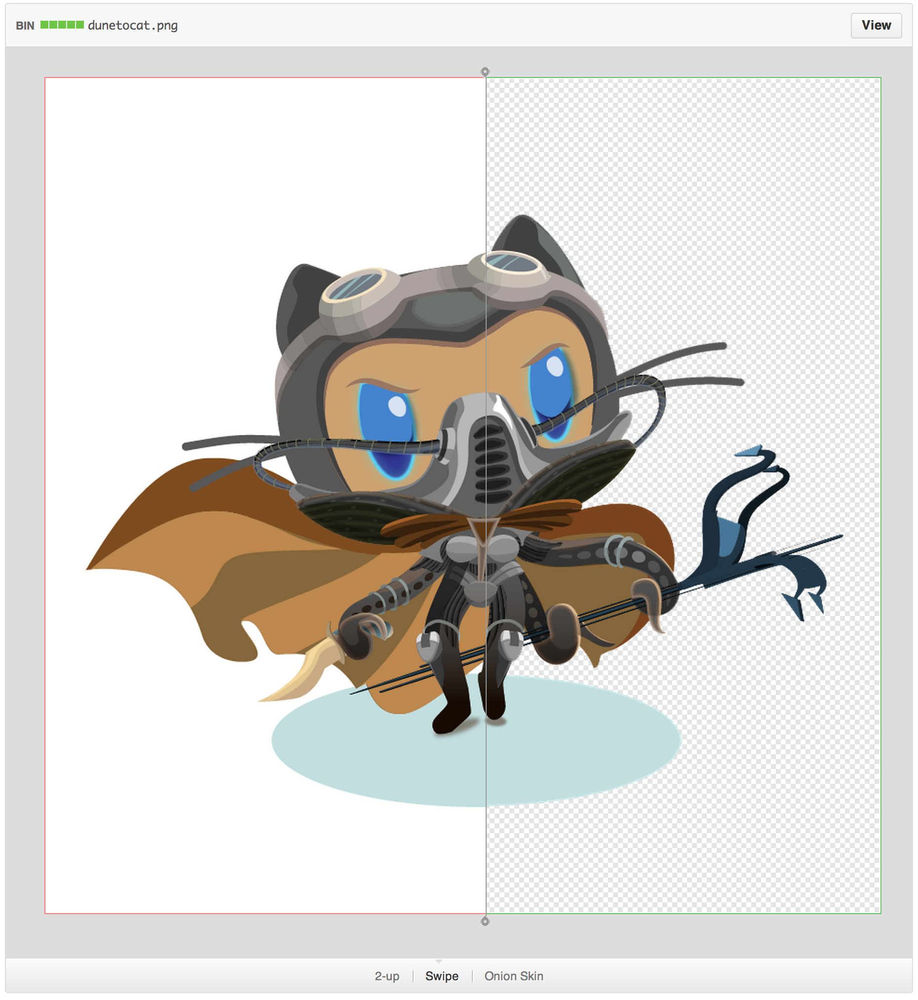

### 

\begin{center}
We used to use a number of disparate services to provide
source control, issue tracking, and documentation for deliverables.
\end{center}

### 

\begin{center}
But now, one service provides all three functionalities.
\end{center}

### 

\begin{center}
\huge We build software. \\
GitHub lets us build better.
\end{center}

### Meet GitHub

### What is GitHub?

noun

**GitHub** is a code repository web-based hosting service, which offers all the features of `git` as well as adding its own features, such as: 

-   Issue-tracking
-   Wikis
-   Project web pages

### What is `git`?

noun

`git` is a distributed revision control and source code management system with an emphasis on speed, data integrity, and support for distributed, non-linear workflows.

### 

### 

### 

###

\begin{center}
But the command line is ... dated.
\end{center}

### 

\begin{center}
\huge GitHub gives you \\
a way to communicate with dev.
\end{center}

### 

### 

### 

\begin{center}
\huge Pause for demo.
\end{center}

### 

\begin{center}
\huge GitHub gives you \\
a way to browse history.
\end{center}

### 

### 

### 

### 

\begin{center}
\huge Pause for demo.
\end{center}
